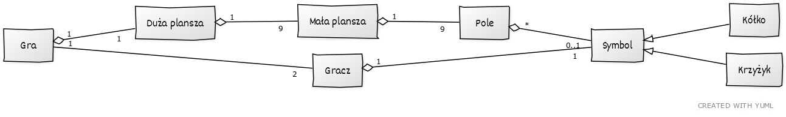

<div id="top"></div>

-->
[![Contributors][contributors-shield]][contributors-url]
[![Forks][forks-shield]][forks-url]
[![Stargazers][stars-shield]][stars-url]
[![Issues][issues-shield]][issues-url]
[![MIT License][license-shield]][license-url]
[![LinkedIn][linkedin-shield]][linkedin-url]


<!-- PROJECT LOGO -->
<br />
<div align="center">
  <h1>🕹️<br><br>❌ Ultimate <b>Tic Tac Toe</b>⭕<br><br>

</h1>
</div>

<div align="center" >
</div>

# Game description

Ultimate tic tac toe, is an extension of the taxing game of tic tac toe. 
Rules:
- The game board consists of **9 game boards**
- Each game board has **9 tiles** for placing a symbol.
- Placing a token on the X (e.g. #4) requires the player to make the next move on the X (e.g. #4).
- Players put **circles** or **crosses** in the boxes until one of them wins or there is a draw on the board.
- The player who wins on a particular board **places his symbol there**. 
- Play continues until someone wins most of the boards, or there is a tie.
- If the game on the selected board is over, the player chooses any field, on any board

Source:
https://en.wikipedia.org/wiki/Ultimate_tic-tac-toe

<p align="right">(<a href="#top">back to top</a>)</p>

### Built With

This section should list any major frameworks/libraries used to bootstrap your project. Leave any add-ons/plugins for the acknowledgements section. Here are a few examples.

* [Java](https://www.java.com/)
* [Open JavaFX SDK](https://openjfx.io/)
* [yUML](https://yuml.me/)

<p align="right">(<a href="#top">back to top</a>)</p>


<!-- GETTING STARTED -->
# Installation

Since I had a lot of problems to fire it up in my configuration (WSL2 Ubuntu 20.04)
here is how I managed to fire the project in **JetBrains IntelliJ**

```sh
sudo apt install openjdk-17-jre-headless
```

```sh
sudo apt install libgtk-3-0
```

I also downloaded [JavaFX library](https://gluonhq.com/products/javafx/) version `openjfx-18.0.1_linux-x64_bin-jmods` (**JMODS** - this is very important, because we work with modular Java)
and put it in the `lib/` directory somewhere on my desktop.

Because of its size (about 100 MB) I did not put the library in the repository

### Open the project

```sh
git clone https://github.com/Ultimate-TicTacToe-Java/UltimateTicTacToe
```

Open **UltimateTicTacToe** in IntelliJ using `File` -> `Open`.

Add the configuration `Add configuration` -> `Application`.

- Choose `openjdk-18` as the environment.

- Select `Game` from the `Chose main class` field.

Close the configuration window. 3.

3. add the JavaFX library

`File` -> `Project Structure...` -> `Libraries` -> `+` -> `Java`

In the path field, paste

`<root path to project>/UltimateTicTacToe/lib/openjfx-18.0.1_linux-x64_bin-jmods/lib`

Build the project

<p align="right">(<a href="#top">back to top</a>)</p>

<!-- BACKLOG -->
## Backlog

[x] - creating a smaller tic-tac-toe game board<br>
[x] - create main game board consisting of 9 smaller fields<br>
[x] - handling the OnClick event when the player presses the mouse button on a given field<br>
[x] - check if the player has won the game in a given field<br>
[x] - check if the player has won the game on the main board<br>
[ ] - adding appropriate notifications during the game and in case of a player victory<br>
    - notifications in console are done<br>
[ ] - testing the game<br>
[ ] - (*) network implementation of the game<br>

# Class diagram



<p align="right">(<a href="#top">back to top</a>)</p>